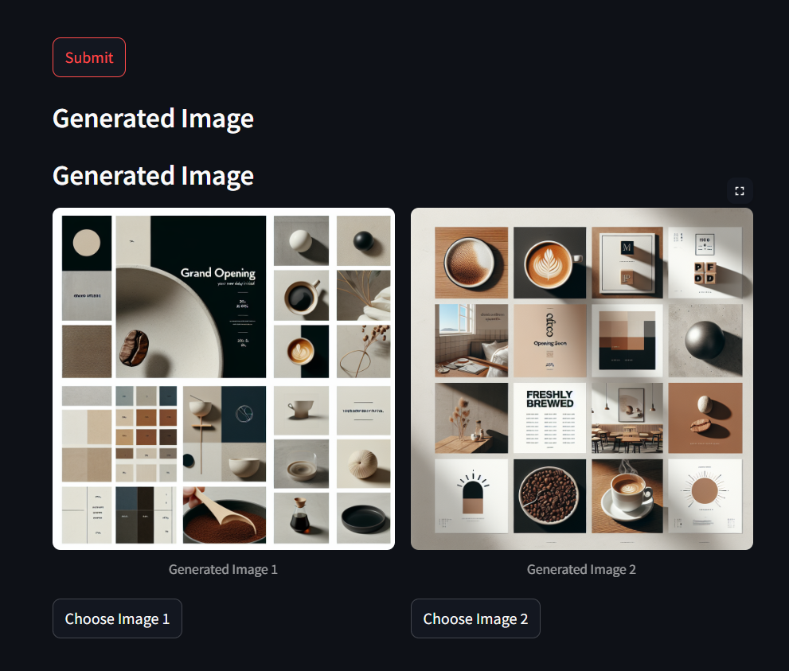

### Test pipeline for moodboard generator feature

How to use:

1. In the file app.py change the hard-coded values of labels and values.
2. Use ```streamlit run app.py``` on terminal to run.
3. For more personalization change the prompt_text.txt according to the requriment.

Example generation:


